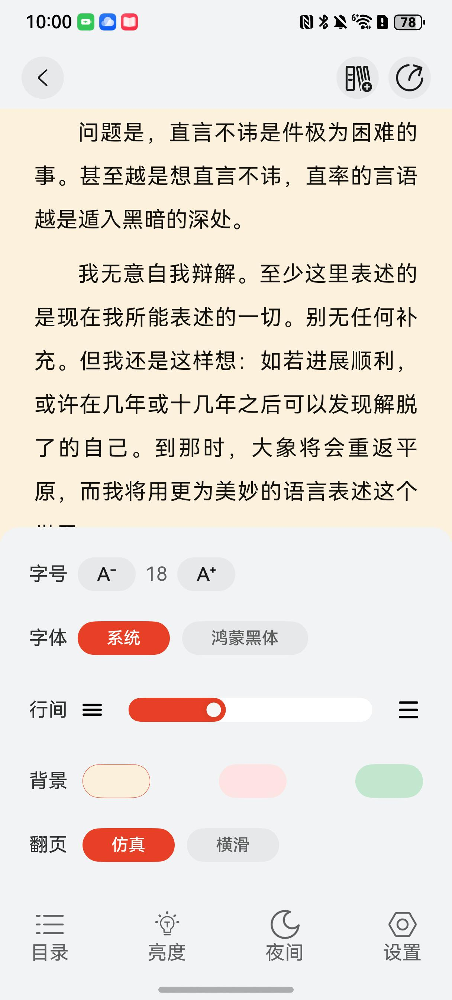
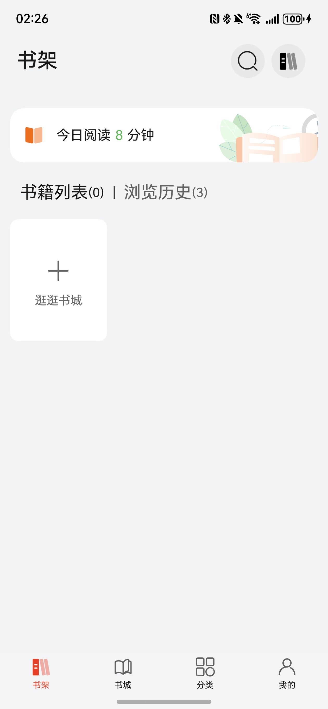
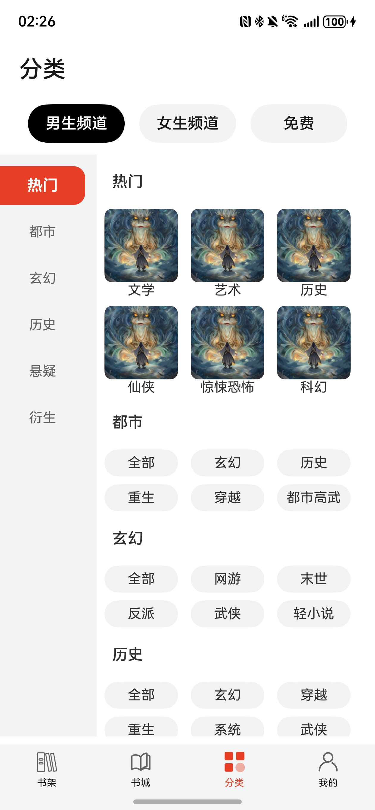

# 阅读与工具书（电子书）应用模板快速入门

## 目录

- [功能介绍](#功能介绍)

- [环境要求](#环境要求)

- [快速入门](#快速入门)

- [示例效果](#示例效果)

- [权限要求](#权限要求)

- [开源许可协议](#开源许可协议)

## 功能介绍
您可以基于此[模板](#模板)直接定制应用/元服务，也可以挑选此模板中提供的多种[组件](#组件)使用，从而降低您的开发难度，提高您的开发效率。

### 模板
本模板为电子书类应用提供了常用功能实现案例，涵盖了从书籍获取、阅读体验到个性化管理的核心环节，模板主要分阅读、书架、书城、分类和我的五大模块：

- 阅读：支持电子书阅读功能及阅读工具（目录导航、字体调整、屏幕亮度调节与深色模式等功能）。
- 书架：提供书籍列表浏览、阅读历史追踪、阅读进度保存、搜索及书籍管理功能。
- 书城：支持历史搜索、热门搜索，并支持“今日力荐”和“猜你喜欢”两种内容推荐功能。
- 分类：支持按男频/女频等大类划分，并支持细分类别的探索，便于找到感兴趣的特定类型作品。
- 我的：支持华为账号登录、个性化阅读偏好设置、账户内资产（书币、会员权益）、活动中心以及问题与反馈等功能。

| 阅读                               | 书架                               | 书城                                  | 分类                              | 我的                              |
|----------------------------------|----------------------------------|-------------------------------------|---------------------------------|---------------------------------|
|  |  |  |  |  |

本模板主要页面涉核心功能清单如下所示：

```ts
阅读听书模板
|--  阅读
 |    |-- 阅读界面
 |    |-- 章节目录
 |    |-- 亮度调整
 |    |-- 深色模式
 |    └-- 阅读设置
 |-- 书架
 |    |-- 书籍列表
 |    |-- 浏览历史
 |    |-- 阅读时长记录
 |    |-- 搜索
 |    └-- 书籍管理
 |-- 书城
 |    |-- 今日力荐
 |    └-- 猜你喜欢
 |-- 分类
 |    |-- 男频/女频分类
 |    └-- 热门、都市、玄幻等分类
 └-- 我的
    |-- 用户登录
    |-- 会员中心
    |     └-- 选择套餐并开通会员
    |-- 我的账户
    |     └-- 选择套餐并充值书币
    |-- 活动中心
    |-- 阅读记录
    |-- 阅读偏好设置
    |     |-- 男频/女频偏好
    |     └-- 热门、都市、玄幻等偏好
    |-- 联系客服
    |-- 问题与反馈
    |     |-- 反馈问题
    |     └-- 反馈记录
    └-- 设置
       |-- 个人信息
       |     └-- 修改头像/昵称/电话
       |-- 隐私设置
       |-- 关于
       └-- 退出登录
```

本模板工程核心代码结构如下所示：

```shell
BookRead
├─BookRead/entry/src/main/ets
│ ├─entryability
│ │ └─EntryAbility.ets                     // 应用主入口能力
│ ├─entrybackupability
│ │ └─EntryBackupAbility.ets               // 应用备份恢复能力配置
│ └─pages
│ ├─BookHomePage.ets                       // 应用主页框架
│ └─Index.ets                              // 应用入口默认首页
│
├─BookRead/commons/common/src/main/ets
│ ├─api
│ │ └─BookApi.ets                          // 图书API调用
│ ├─comp
│ │ ├─AggregatedPaymentPicker.ets          // 集成支付选择器组件
│ │ ├─GlobalContext.ets                    // 全局上下文管理类
│ │ ├─TCInvoke.ets                         // 终端云服务调用封装
│ │ ├─TCLogger.ets                         // 终端云日志记录工具
│ │ ├─TCRouter.ets                         // 终端云路由导航管理
│ │ └─Toast.ets                            // 提示消息显示
│ ├─constant
│ │ └─Constants.ets                        // 常量定义文件
│ ├─model
│ │ ├─Book.ets                             // 图书数据模型
│ │ ├─BookSortInfo.ets                     // 图书排序信息模型
│ │ ├─BorrowInfo.ets                       // 借阅信息模型
│ │ ├─FeedbackRecordModel.ets              // 反馈记录模型
│ │ ├─Member.ets                           // 会员信息模型
│ │ ├─PaymentModels.ets                    // 支付相关信息模型
│ │ ├─PreferenceInfo.ets                   // 用户偏好设置模型
│ │ ├─ReadSet.ets                          // 阅读模型
│ │ └─UserInfoModel.ets                    // 用户信息模型
│ ├─ui
│ │ ├─BookCard.ets                         // 图书卡片组件
│ │ ├─CommonUI.ets                         // 基础UI组件
│ │ └─TSearch.ets                          // 搜索功能相关组件
│ ├─utils
│ │ ├─EpubUtils.ets                        // Epub格式相关工具方法
│ │ ├─FileUtils.ets                        // 文件操作工具类
│ │ ├─MathUtil.ets                         // 数学计算工具类
│ │ ├─TimeUtils.ets                        // 时间处理工具类
│ │ ├─UserInfoUtil.ets                     // 用户信息处理工具类
│ │ └─WindowUtils.ets                      // 窗口或界面尺寸相关工具
│ └─payment
│   ├─AggregatedPaymentVM.ets              // 集成支付业务逻辑模型
│   ├─MockApi.ets                          // 模拟API
│   ├─OrderInfoUtil.ets                    // 订单信息处理
│   └─SignUtils.ets                        // 签名相关工具
│
├─BookRead/feature/book_home/src/main/ets
│ ├─comps
│ │ ├─BookListCard.ets                     // 图书列表卡片式展示组件
│ │ ├─BookSwiperCard.ets                   // 图书轮播图展示卡片
│ │ ├─BookViewCard.ets                     // 图书详情视图卡片
│ │ ├─BookWaterFlowCard.ets                // 图书瀑布流布局组件
│ │ └─HotRankCard.ets                      // 热门排行榜卡片
│ ├─viewModels
│ │ └─SearchViewModels.ets                 // 搜索功能逻辑模型
│ └─views
│   ├─BookListPage.ets                     // 图书列表页面
│   ├─BookViewListPage.ets                 // 带分类的图书列表视图页
│   └─SearchPage.ets                       // 全站搜索功能主页面
│
├─BookRead/feature/book_person/src/main/ets
│ ├─comp
│ │ ├─AccountCard.ets                      // 用户账户余额信息卡片
│ │ ├─ActivityCard.ets                     // 活动信息展示卡片
│ │ ├─CenterToolCard.ets                   // 个人中心工具卡片集
│ │ ├─FileSelect.ets                       // 文件选择器组件
│ │ ├─MembershipCard.ets                   // 会员身份展示卡片
│ │ ├─MyBalanceCard.ets                    // 余额信息展示卡片
│ │ ├─MyInfoCard.ets                       // 个人基本信息展示卡片
│ │ ├─OptionView.ets                       // 选项卡片组件
│ │ ├─PaymentSheet.ets                     // 支付功能底部弹窗
│ │ ├─SelectAvatarCard.ets                 // 头像选择器组件
│ │ ├─ServiceCard.ets                      // 服务入口卡片
│ │ ├─UsrMsgCard.ets                       // 用户信息卡片
│ ├─viewmodel
│ │ ├─MemberCenterVM.ets                   // 会员中心逻辑模型
│ │ ├─RechargeRecordVM.ets                 // 充值记录逻辑模型
│ │ └─RechargeVM.ets                       // 充值功能业务逻辑模型
│ └─views
│   ├─AboutPage.ets                        // 关于我们信息页
│   ├─AccountPage.ets                      // 账户管理主页面
│   ├─ActivityPage.ets                     // 活动信息列表页
│   ├─DataCollectionPage.ets               // 用户数据采集页
│   ├─DataSharingPage.ets                  // 数据共享协议页
│   ├─FeedbackPage.ets                     // 意见反馈表单页
│   ├─FeedbackRecordPage.ets               // 反馈记录列表页
│   ├─IssueAndFeedbackPage.ets             // 问题反馈页面
│   ├─LibraryPage.ets                      // 我的书馆页面
│   ├─LoginPage.ets                        // 用户登录页
│   ├─MemberAgreementPage.ets              // 会员协议展示页
│   ├─MemberCenterPage.ets                 // 会员中心主界面
│   ├─PersonPage.ets                       // 个人中心主页
│   ├─PreferencePage.ets                   // 偏好设置页面
│   ├─PrivacyPage.ets                      // 隐私设置界面
│   ├─PrivacyPolicyPage.ets                // 隐私政策声明页
│   ├─RechargePage.ets                     // 充值中心主界面
│   ├─RechargeRecordPage.ets               // 充值记录查询页
│   └─SettingPage.ets                      // 系统设置综合页面
│
├─BookRead/feature/book_read_kit/src/main/ets
│ └─components
│   ├─BookCoverCard.ets                    // 图书封面展示组件
│   ├─ReaderPage.ets                       // 阅读器核心页面
│   ├─ReaderTopCard.ets                    // 阅读器顶部控制栏
│   └─ShareBookCard.ets                    // 图书分享功能组件
│
├─BookRead/feature/book_shelf/src/main/ets
│ ├─comps
│ │ └─DeleteBottomCard.ets                 // 书籍删除确认底部弹窗
│ └─views
│   └─BookShelfPage.ets                    // 我的书架主界面
│
├─BookRead/feature/book_sort/src/main/ets
│ └─pages
│   └─BookSortPage.ets                     // 图书分类导航页面
│
├─BookRead/components/base_common/src/main/ets
│ └─components
│   ├─ActionSheet.ets                      // 阅读器底部工具栏
│   └─UserInfo.ets                         // 阅读器用户信息
│
├─BookRead/components/reader_tool_bar/src/main/ets
│ └─components
│   ├─ReaderToolBar.ets                    // 阅读器底部工具栏
│   └─SelectState.ets                      // 文本选择状态组件
│
└─BookRead/components/swiper_card/src/main/ets
  ├─components
  │ ├─BookSingleSwiper.ets                 // 单图书滑动展示组件
  │ ├─example.ets                          // 组件使用示例
  │ └─TUISwiper.ets                        // 通用滑动卡片组件
  └─model
    ├─Book.ets                             // 图书数据模型定义
    └─LazyDataVM.ets                       // 数据逻辑模型

```

### 组件

本模板中提供了多种组件，您可以按需选择合适的组件进行使用，所有组件存放在工程根目录的components下。

| 组件                                | 描述                                                         | 使用指导                                         |
| ----------------------------------- | ------------------------------------------------------------ | ------------------------------------------------ |
| 阅读器工具栏组件（reader_tool_bar） | 支持在阅读器工具展示常用功能，例如目录选择、字体、字号、行间距、背景设置等。 | [使用指导](components/reader_tool_bar/README.md) |
| 滑动卡片组件（swiper_card）         | 展示可滑动图片组                                             | [使用指导](components/swiper_card/README.md)     |


## 环境要求

### 软件

* DevEco Studio版本：DevEco Studio 5.0.4 Release及以上
* HarmonyOS SDK版本：HarmonyOS 5.0.4 Release SDK及以上

### 硬件

* 设备类型：华为手机（直板机）
* HarmonyOS版本：HarmonyOS 5.0.4 Release及以上

## 快速入门

###  配置工程

在运行此模板前，需要完成以下配置：

1. 在AppGallery Connect创建应用，将包名配置到模板中。

   a. 参考[创建应用](https://developer.huawei.com/consumer/cn/doc/app/agc-help-createharmonyapp-0000001945392297)为应用创建 APPID 和应用包名，并将APPID与应用进行关联。

   b. 返回应用列表页面，查看应用的包名。

   c. 将模板工程根目录下AppScope/app.json5文件中的bundleName替换为创建应用的包名。

2. 配置华为账号服务。

   a. 将应用的client ID配置到entry模块的src/main/module.json5文件，详细参考：[配置Client ID](https://developer.huawei.com/consumer/cn/doc/harmonyos-guides/account-client-id)。

   b. 添加公钥指纹，详细参考：[配置应用证书指纹](https://developer.huawei.com/consumer/cn/doc/app/agc-help-signature-info-0000001628566748#section5181019153511)。

   c. 申请华为帐号一键登录所需的quickLoginMobilePhone权限，详细参考：[配置scope权限](https://developer.huawei.com/consumer/cn/doc/harmonyos-guides/account-config-permissions)。在端侧使用快速验证手机号码Button进行[验证获取手机号码](https://developer.huawei.com/consumer/cn/doc/harmonyos-guides/account-get-phonenumber)。

3. 配置支付服务。

   华为支付当前仅支持商户接入，在使用服务前，需要完成商户入网、开发服务等相关配置，本模板仅提供了端侧集成的示例。详细参考：[支付服务接入准备](https://developer.huawei.com/consumer/cn/doc/harmonyos-guides/payment-preparations)。

### 运行调试工程

1. 连接调试手机和PC。

2. 对应用[手工签名](https://developer.huawei.com/consumer/cn/doc/harmonyos-guides-V5/ide-signing-V5#section297715173233)。

3. 菜单选择“Run > Run 'entry' ”或者“Run > Debug 'entry' ”，运行或调试模板工程。

## 示例效果

阅读                                | 书架                               | 书城                                  | 分类                              | 我的                              |
|----------------------------------|----------------------------------|-------------------------------------|---------------------------------|---------------------------------|
|  |  |  |  |  |

## 权限要求

- 网络权限：ohos.permission.INTERNET、ohos.permission.GET_NETWORK_INFO

## 开源许可协议

该代码经过[Apache 2.0 授权许可](http://www.apache.org/licenses/LICENSE-2.0)。